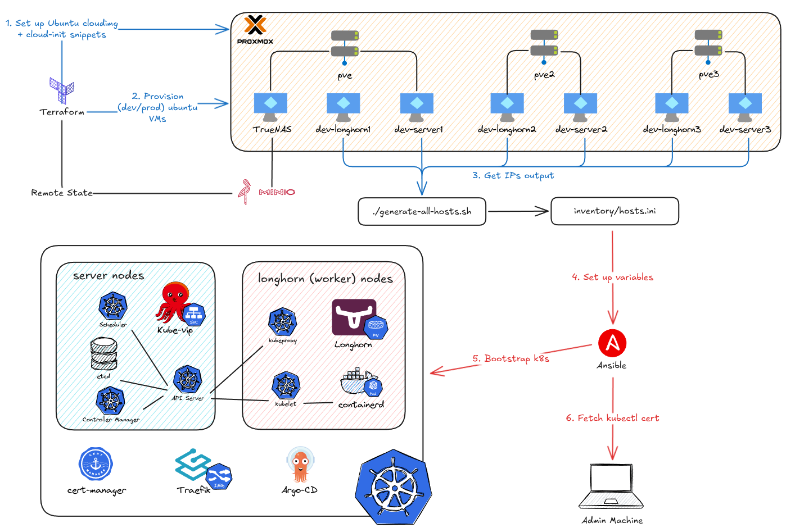

# RKE2 Kubernetes on Proxmox with Terraform + Ansible



This project automates the provisioning and configuration of a RKE2 Kubernetes cluster on **Proxmox** using **Terraform** and **Ansible**.

**Features:**

- `S3-compatible` object storage for `Terraform` remote state
- Separate `dev` and `prod` environments
- Multiple-node `Proxmox` cluster support

**Pre-deployed applications:**

- `kube-vip` for a high-availability virtual IP
- SSL via `cert-manager` with `Cloudflare` DNS
- `Longhorn` for persistent storage
- `ArgoCD` for GitOps deployments

**Blog post:** <https://phuchoang.sbs/posts/on-premise-provision-terraform/>

**Video demo:**
[](https://youtu.be/IrlKAG5bctk)

---

## Project Versions

This project is available in two versions (toggle between branches):

- **`master` (default)**: Automated deployment via GitHub Actions with HashiCorp Vault integration
  - Terraform and Ansible run automatically in GitHub Actions CI/CD pipeline
  - Secrets managed centrally via HashiCorp Vault
  - JWT authentication for GitHub Actions (no secrets stored in GitHub)
  - SSH Certificate Authority for secure VM access
- **`non-vault`**: Manual deployment version for local execution
  - Run Terraform and Ansible locally from your machine
  - Use standard environment variables for configuration

### Switch Between Versions

```bash
# Automated GitHub Actions version (default)
git checkout master

# Manual local deployment version
git checkout non-vault
```

---

## Clone the Repository

```bash
git clone https://github.com/phuchoang2603/kubernetes-proxmox
cd kubernetes-proxmox

# Defaults to master branch (GitHub Actions automation)
# Switch to non-vault for manual/local deployment:
# git checkout non-vault
```

---

## Setup Overview (master branch)

The `master` branch is designed for **fully automated deployments via GitHub Actions**. All Terraform provisioning and Ansible configuration runs in CI/CD pipelines.

### Prerequisites

1. **HashiCorp Vault** instance (accessible via network)
2. **Tailscale** account for secure network access
3. **GitHub repository** with appropriate permissions
4. **Proxmox** cluster with API access
5. **S3-compatible storage** (MinIO) for Terraform state

### Architecture

```
GitHub Actions → Tailscale VPN → Vault (secrets) → Proxmox (VMs) → RKE2 Cluster
                                     ↓
                              Terraform State (S3/MinIO)
```

---

## Step 1: Configure HashiCorp Vault

Set up Vault to store secrets and provide GitHub Actions authentication.

### 1.1 Deploy Vault Admin Resources

```bash
cd terraform-admin
terraform init
terraform apply
```

This creates:

- JWT authentication backend for GitHub Actions
- Environment-specific policies for dev and prod
- SSH Certificate Authority for both environments
- Vault roles for push and PR workflows

### 1.2 Store Secrets in Vault

```bash
# Set Vault address and authenticate
export VAULT_ADDR="https://your-vault-address"
export VAULT_TOKEN="your-vault-token"

# Shared secrets (used by both dev and prod)
vault kv put kv/shared/minio access_key="..." secret_key="..."
vault kv put kv/shared/proxmox endpoint="..." username="..." password="..."
vault kv put kv/shared/cloudflare api_token="..." domain="..." email="..."

# Dev environment secrets
vault kv put kv/dev/ip vip="10.69.0.10" cidr="24" lb_range="10.69.0.50-10.69.0.100" ingress="10.69.0.50"
vault kv put kv/dev/rke2 token="your-rke2-token"

# Prod environment secrets
vault kv put kv/prod/ip vip="10.69.1.10" cidr="24" lb_range="10.69.1.50-10.69.1.100" ingress="10.69.1.50"
vault kv put kv/prod/rke2 token="your-rke2-token"
```

---

## Step 2: Configure GitHub Repository

### 2.1 Set GitHub Variables

Navigate to your GitHub repository → Settings → Secrets and variables → Actions → Variables:

| Variable Name | Value                       | Description                             |
| ------------- | --------------------------- | --------------------------------------- |
| `ENV_NAME`    | `dev` or `prod`             | Environment to deploy                   |
| `VAULT_ADDR`  | `https://vault.example.com` | Vault server address                    |
| `DESTROY`     | `false`                     | Set to `true` to destroy infrastructure |

### 2.2 Set GitHub Secrets

Navigate to Secrets tab and add:

| Secret Name          | Value                          | Description    |
| -------------------- | ------------------------------ | -------------- |
| `TS_OAUTH_CLIENT_ID` | Your Tailscale OAuth client ID | For VPN access |
| `TS_OAUTH_SECRET`    | Your Tailscale OAuth secret    | For VPN access |

### 2.3 Update VM Configurations

Edit the JSON files for your environment:

**For Dev:** `terraform-provision/env/dev/k8s_nodes.json` and `longhorn_nodes.json`
**For Prod:** `terraform-provision/env/prod/k8s_nodes.json` and `longhorn_nodes.json`

Example `k8s_nodes.json`:

```json
[
  {
    "hostname": "k8s-server-01",
    "ip": "10.69.0.11"
  },
  {
    "hostname": "k8s-server-02",
    "ip": "10.69.0.12"
  }
]
```

---

## Step 3: Deploy via GitHub Actions

### Automatic Deployment

The deployment happens automatically via GitHub Actions:

1. **On Pull Request**: Plans Terraform changes and posts a comment with the plan
2. **On Push to Master**: Applies Terraform changes and runs Ansible playbook

### Workflow Steps

The `.github/workflows/terraform-ansible.yml` workflow:

1. Connects to Tailscale VPN for private network access
2. Authenticates to Vault via JWT (no GitHub secrets needed!)
3. Retrieves all secrets dynamically from Vault
4. Provisions VMs with Terraform (`terraform-provision/`)
5. Configures RKE2 cluster with Ansible
6. Deploys kube-vip, cert-manager, Traefik, Longhorn, and ArgoCD

### Manual Trigger

You can also manually trigger the workflow:

1. Go to Actions tab in GitHub
2. Select "Provision and Bootstrap" workflow
3. Click "Run workflow"
4. Choose the branch and run

---

## Step 4: Access Your Cluster

After the GitHub Actions workflow completes:

### 4.1 Retrieve Kubeconfig

SSH into your first server node:

```bash
ssh ubuntu@<server-ip>
sudo cat /etc/rancher/rke2/rke2.yaml
```

Copy the kubeconfig and update the server address to your VIP.

### 4.2 Verify Cluster

```bash
export KUBECONFIG=~/.kube/rke2-config
kubectl get nodes
kubectl get pods -A
```

### 4.3 Access Services

- **Longhorn UI**: `https://longhorn.<your-domain>`
- **ArgoCD**: `https://argocd.<your-domain>`
  - Get admin password: `kubectl -n argocd get secret argocd-initial-admin-secret -o jsonpath="{.data.password}" | base64 -d`

---

## How It Works

### Terraform Provisioning (`terraform-provision/`)

GitHub Actions workflow:

1. Initializes Terraform with S3 backend (environment-specific state file)
2. Retrieves Proxmox credentials from Vault
3. Downloads Ubuntu cloud image
4. Creates cloud-init configuration snippets
5. Provisions VMs for Kubernetes and Longhorn nodes

### Ansible Configuration (`ansible/`)

After VMs are ready:

1. Generates inventory from JSON files
2. Signs ephemeral SSH key via Vault SSH CA (no persistent keys!)
3. Installs RKE2 on server and agent nodes
4. Deploys kube-vip for HA virtual IP
5. Configures cert-manager with Cloudflare DNS
6. Installs Traefik ingress controller
7. Deploys Longhorn for persistent storage
8. Installs ArgoCD for GitOps

---

## Destroy Infrastructure

To destroy all resources:

1. Set GitHub variable `DESTROY=true`
2. Push to master or manually trigger workflow
3. GitHub Actions will run `terraform destroy`

Or manually:

```bash
cd terraform-provision
terraform init -reconfigure -backend-config="key=<env>.tfstate"
terraform destroy -var-file="env/<env>/main.tfvars"
```

**Note:** For local/manual deployment without GitHub Actions, switch to the `non-vault` branch.

---

## Credits

- Inspired by [JimsGarage RKE2 Ansible Playbooks](https://github.com/JamesTurland/JimsGarage)
- Built with the [bpg Proxmox Terraform Provider](https://registry.terraform.io/providers/bpg/proxmox/latest)
