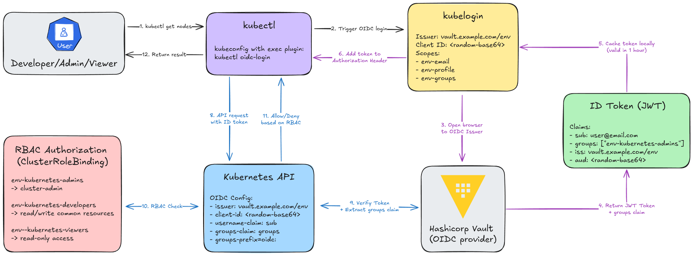

# RKE2 Kubernetes on Proxmox with Terraform + Ansible

This project automates the provisioning and configuration of a RKE2 Kubernetes cluster on Proxmox using Terraform and Ansible. Using GitHub Actions and HashiCorp Vault, the project achieves a fully automated CI/CD pipeline with centralized secret management.

**Demo Video**:

[](https://youtu.be/G83csoZYCWQ)

## How It Works

> **Note:** HashiCorp Vault is deployed externally (outside the cluster) and serves as both the secrets manager and OIDC identity provider. This avoids the chicken-and-egg problem where OIDC authentication is required to access the cluster that hosts the OIDC provider.

### Terraform Provisioning (`terraform-provision/`)

1. Initializes Terraform with S3 backend (environment-specific state file)
2. Retrieves Proxmox credentials (from Vault or env vars)
3. Downloads Ubuntu cloud image
4. Creates cloud-init configuration snippets
5. Provisions VMs for Kubernetes and Longhorn nodes

### Ansible Configuration (`ansible/`)

After VMs are ready:

1. Generates inventory from JSON files
2. Authenticates via Vault SSH CA (automated) or standard SSH (manual)
3. Installs RKE2 on server and agent nodes with OIDC integration using Vault as the identity provider
4. Deploys kube-vip for HA virtual IP
5. **Deploys all essential applications via data-driven approach** (`deploy_helm_apps` role):
   - cert-manager with Cloudflare DNS
   - Traefik ingress controller with auto HTTPS
   - Longhorn distributed storage
   - CloudNativePG PostgreSQL operator
   - External Secrets Operator
   - ArgoCD for GitOps

All Helm applications are configured in a single data-driven file. To add/modify applications, simply edit `ansible/inventory/group_vars/all/helm.yaml`. The generic `deploy_helm_apps` role automatically:

- Deploys HelmChart resources
- Creates IngressRoutes for apps with ingress enabled
- Applies additional manifests (e.g., ClusterIssuers, DaemonSets)

## Choose Your Deployment Method

### Option A: Automated Deployment (GitHub Actions + Vault)

Fully automated CI/CD pipeline with centralized secret management.

**Blog post:** <https://phuchoang.sbs/posts/gitops-github-actions-hashicorp-vault/>


#### Prerequisites

1. **HashiCorp Vault** instance (accessible via network)
2. **Tailscale** account for secure network access (Optional)
3. **GitHub repository** with appropriate permissions
4. **Proxmox** cluster with API access
5. **S3-compatible storage** (MinIO) for Terraform state

#### Step 1: Configure HashiCorp Vault

##### 1.1 Store Secrets in Vault (could be done via UI)

```bash
# Set Vault address and authenticate
export VAULT_ADDR="https://your-vault-address"
export VAULT_TOKEN="your-vault-token"

# Shared secrets (used by both dev and prod)
vault kv put kv/shared/minio access_key="..." secret_key="..."
vault kv put kv/shared/proxmox endpoint="..." username="..." password="..."
vault kv put kv/shared/cloudflare api_token="..." domain="..." email="..."

# Dev environment secrets
vault kv put kv/dev/ip vip="10.69.0.10" cidr="24" lb_range="10.69.0.50-10.69.0.100" ingress="10.69.0.50"
vault kv put kv/dev/rke2 token="your-rke2-token"

# Prod environment secrets
vault kv put kv/prod/ip vip="10.69.1.10" cidr="24" lb_range="10.69.1.50-10.69.1.100" ingress="10.69.1.50"
vault kv put kv/prod/rke2 token="your-rke2-token"
```

##### 1.2 Deploy Vault Admin Resources

```bash
cd terraform-admin

# Set the same address as a Terraform variable (used for OIDC issuer URL)
export TF_VAR_vault_addr="$VAULT_ADDR"

# Set your S3 backend credentials
export AWS_ACCESS_KEY_ID=$(vault kv get -field=access_key kv/shared/minio)
export AWS_SECRET_ACCESS_KEY=$(vault kv get -field=secret_key kv/shared/minio)

terraform init
terraform apply
```

This creates:

- JWT authentication backend for GitHub Actions
- Environment-specific policies for dev and prod
- SSH Certificate Authority for both environments
- Vault roles for push and PR workflows
- **OIDC provider configuration for Kubernetes authentication**
- Vault groups for Kubernetes RBAC (admins, developers, viewers)
- OIDC scopes with groups claim support

##### 1.3 Create Vault Users (via Terraform)

Edit the `terraform-admin/users.tf` file and uncomment the user examples. Currently, there is a bug where you can't create user before deploying OIDC provider and groups.

```hcl
locals {
  users = {
    "admin-user" = {
      email    = "admin@example.com"
      password = "your-secure-password"
      # Reference groups directly from OIDC modules
      group_ids = [
        module.vault_oidc_dev.group_ids["admins"],
        module.vault_oidc_prod.group_ids["admins"]
      ]
    }

    "developer" = {
      email     = "developer@example.com"
      password  = "your-secure-password"
      group_ids = [
        module.vault_oidc_dev.group_ids["developers"]
      ]
    }
  }
}
```

Then apply:

```bash
cd terraform-admin
terraform apply
```

**Available group references:**

- `module.vault_oidc_dev.group_ids["admins"]` - Dev cluster admin
- `module.vault_oidc_dev.group_ids["developers"]` - Dev cluster developer
- `module.vault_oidc_dev.group_ids["viewers"]` - Dev cluster viewer
- `module.vault_oidc_prod.group_ids["admins"]` - Prod cluster admin
- `module.vault_oidc_prod.group_ids["developers"]` - Prod cluster developer
- `module.vault_oidc_prod.group_ids["viewers"]` - Prod cluster viewer

**Kubernetes RBAC roles:**

- `{env}-kubernetes-admins`: Full cluster admin
- `{env}-kubernetes-developers`: Application developer access
- `{env}-kubernetes-viewers`: Read-only access

#### Step 2: Configure GitHub Repository

##### 2.1 Update VM Configurations

Edit the JSON files for your environment:

**For Dev:** `terraform-provision/env/dev/k8s_nodes.json` and `longhorn_nodes.json`  
**For Prod:** `terraform-provision/env/prod/k8s_nodes.json` and `longhorn_nodes.json`

Example `k8s_nodes.json`:

```json
[
  {
    "hostname": "k8s-server-01",
    "ip": "10.69.0.11"
  },
  {
    "hostname": "k8s-server-02",
    "ip": "10.69.0.12"
  }
]
```

##### 2.2 Set GitHub Variables

Navigate to your GitHub repository → Settings → Secrets and variables → Actions → Variables:

| Variable Name | Value                       | Description                                              |
| ------------- | --------------------------- | -------------------------------------------------------- |
| `ENV_NAME`    | `dev` or `prod`             | Environment to deploy                                    |
| `VAULT_ADDR`  | `https://vault.example.com` | Vault server address (used to construct OIDC issuer URL) |
| `DESTROY`     | `false`                     | Set to `true` to destroy infrastructure                  |

**Note:** The OIDC issuer URL and client ID are automatically constructed from these variables:

- OIDC Issuer URL: `${VAULT_ADDR}/v1/identity/oidc/provider/${ENV_NAME}`
- OIDC Client ID: `${ENV_NAME}-kubernetes`

##### 2.3 Set GitHub Secrets (Optional)

If you don't want to use self-hosted Github Actions, you can get the runner access to your private network using Tailscale VPN. Navigate to Secrets tab and add:

| Secret Name          | Value                          | Description    |
| -------------------- | ------------------------------ | -------------- |
| `TS_OAUTH_CLIENT_ID` | Your Tailscale OAuth client ID | For VPN access |
| `TS_OAUTH_SECRET`    | Your Tailscale OAuth secret    | For VPN access |

#### Step 3: Deploy via GitHub Actions

The deployment happens automatically:

1. **On Pull Request**: Plans Terraform changes and posts a comment with the plan
2. **On Push to Master**: Applies Terraform changes and runs Ansible playbook

**Workflow steps:**

1. Runs linting checks (Terraform + Ansible)
2. Connects to Tailscale VPN for private network access
3. Authenticates to Vault via JWT (no GitHub secrets needed!)
4. Retrieves all secrets dynamically from Vault
5. Provisions VMs with Terraform (terraform-provision/)
6. Configures RKE2 cluster with Ansible (with Vault OIDC pre-configured from GitHub variables)
7. Deploys all applications via data-driven `deploy_helm_apps` role

#### Step 4: Access Your Cluster



##### Install int128/kubelogin & Configure kubectl with OIDC

Create a kubeconfig file (`~/.kube/dev-config.yml`):

```yaml
apiVersion: v1
kind: Config
clusters:
  - cluster:
      server: https://10.69.1.110:6443 # Replace with your VIP
      insecure-skip-tls-verify: true # Only if using self-signed certs
    name: dev-rke2
contexts:
  - context:
      cluster: dev-rke2
      user: vault-oidc
    name: dev-rke2
current-context: dev-rke2
users:
  - name: vault-oidc
    user:
      exec:
        apiVersion: client.authentication.k8s.io/v1beta1
        command: kubectl
        args:
          - oidc-login
          - get-token
          - --oidc-issuer-url=https://vault.example.com/v1/identity/oidc/provider/dev
          - --oidc-client-id=<fetch-from-Vault>
          - --oidc-extra-scope=dev-email
          - --oidc-extra-scope=dev-profile
          - --oidc-extra-scope=dev-groups
```

**Replace placeholders:**

- `10.69.1.110`: Your cluster VIP (dev: `10.69.1.110`, prod: `10.69.1.10`)
- `vault.example.com`: Your Vault instance URL
- `oidc-client-id`: Fetch from Vault, as it was created dynamically using terraform-admin.
- Replace with your environment name (`dev` or `prod`) in OIDC scope names (all scopes are prefixed with environment)

##### Authenticate and Access

```bash
export KUBECONFIG=~/.kube/dev-config.yml

# Clear any cached tokens
rm -rf ~/.kube/cache/oidc-login/

# This will prompt for Vault userpass credentials
kubectl get nodes

# Verify your identity
kubectl auth whoami

# Check permissions
kubectl auth can-i create pods
```

**First-time login flow:**

1. Browser opens to Vault login page
2. Select "Username & Password" (userpass)
3. Enter your Vault username and password
4. kubectl will cache the OIDC token

Users are automatically granted permissions based on their Vault group membership:

- **{env}-kubernetes-admins**: Full cluster admin access (cluster-admin)
- **{env}-kubernetes-developers**: Read/write access to application resources
- **{env}-kubernetes-viewers**: Read-only access to all namespaces

**To modify user access:** Update the `group_ids` list in your `users.auto.tfvars` file and run `terraform apply` again.

#### Destroy Infrastructure

1. Set GitHub variable `DESTROY=true`
2. Push to master or manually trigger workflow
3. GitHub Actions will run `terraform destroy`

### Option B: Manual Deployment (Local Execution)

Run Terraform and Ansible locally from your machine.

**Blog post:** <https://phuchoang.sbs/posts/on-premise-provison-ansible/>


## Credits

- Inspired by [JimsGarage RKE2 Ansible Playbooks](https://github.com/JamesTurland/JimsGarage)
- Built with the [bpg Proxmox Terraform Provider](https://registry.terraform.io/providers/bpg/proxmox/latest)
