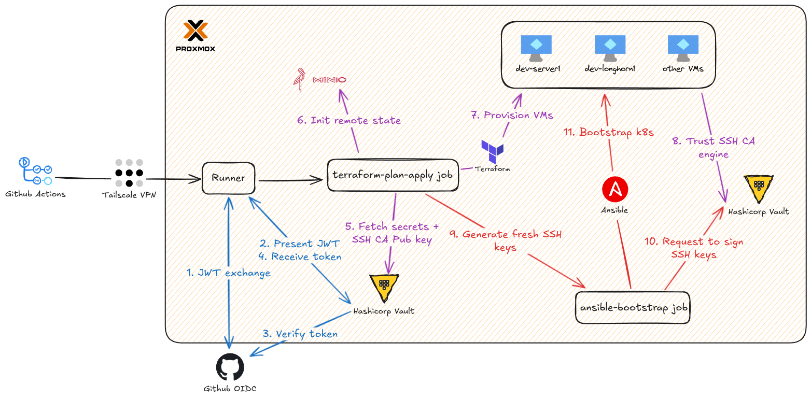

# RKE2 Kubernetes on Proxmox with Terraform + Ansible

This project automates the provisioning and configuration of a RKE2 Kubernetes cluster on **Proxmox** using **Terraform** and **Ansible**.

## How It Works

### Terraform Provisioning (`terraform-provision/`)

1. Initializes Terraform with S3 backend (environment-specific state file)
2. Retrieves Proxmox credentials (from Vault or env vars)
3. Downloads Ubuntu cloud image
4. Creates cloud-init configuration snippets
5. Provisions VMs for Kubernetes and Longhorn nodes

### Ansible Configuration (`ansible/`)

After VMs are ready:

1. Generates inventory from JSON files
2. Authenticates via Vault SSH CA (automated) or standard SSH (manual)
3. Installs RKE2 on server and agent nodes with OIDC integration for Authentik (deployed externally)
4. Deploys kube-vip for HA virtual IP
5. **Deploys all essential applications via data-driven approach** (`deploy_helm_apps` role):
   - cert-manager with Cloudflare DNS
   - Traefik ingress controller with auto HTTPS
   - Longhorn distributed storage
   - CloudNativePG PostgreSQL operator
   - External Secrets Operator
   - ArgoCD for GitOps

> **Note:** HashiCorp Vault + Authentik are deployed externally (outside the cluster) to avoid the chicken-and-egg problem where OIDC authentication is required to access the cluster that hosts the OIDC provider.

All Helm applications are configured in a single data-driven file. To add/modify applications, simply edit `helm.yaml`:

```yaml
helm_applications:
  - name: my-app
    chart: my-app
    version: v1.0.0
    repo: https://charts.example.com
    namespace: my-namespace
    values_content: |
      key: value
    ingress:
      enabled: true
      host: "myapp.{{ ssl_local_domain }}"
      service_name: my-app-service
      service_port: 80
```

The generic `deploy_helm_apps` role automatically:

- Deploys HelmChart resources
- Creates IngressRoutes for apps with ingress enabled
- Applies additional manifests (e.g., ClusterIssuers, DaemonSets)

## Choose Your Deployment Method

### Option A: Automated Deployment (GitHub Actions + Vault)

Fully automated CI/CD pipeline with centralized secret management.

**Blog post:** <https://phuchoang.sbs/posts/gitops-github-actions-hashicorp-vault/>



#### Prerequisites

1. **HashiCorp Vault** + **Authentik** instance (accessible via network)
2. **Tailscale** account for secure network access
3. **GitHub repository** with appropriate permissions
4. **Proxmox** cluster with API access
5. **S3-compatible storage** (MinIO) for Terraform state

#### Step 1: Configure HashiCorp Vault

##### 1.1 Deploy Vault Admin Resources

```bash
cd terraform-admin
terraform init
terraform apply
```

This creates:

- JWT authentication backend for GitHub Actions
- Environment-specific policies for dev and prod
- SSH Certificate Authority for both environments
- Vault roles for push and PR workflows

##### 1.2 Store Secrets in Vault

```bash
# Set Vault address and authenticate
export VAULT_ADDR="https://your-vault-address"
export VAULT_TOKEN="your-vault-token"

# Shared secrets (used by both dev and prod)
vault kv put kv/shared/minio access_key="..." secret_key="..."
vault kv put kv/shared/proxmox endpoint="..." username="..." password="..."
vault kv put kv/shared/cloudflare api_token="..." domain="..." email="..."
vault kv put kv/shared/oidc bt_token="..."

# Dev environment secrets
vault kv put kv/dev/ip vip="10.69.0.10" cidr="24" lb_range="10.69.0.50-10.69.0.100" ingress="10.69.0.50"
vault kv put kv/dev/rke2 token="your-rke2-token"

# Prod environment secrets
vault kv put kv/prod/ip vip="10.69.1.10" cidr="24" lb_range="10.69.1.50-10.69.1.100" ingress="10.69.1.50"
vault kv put kv/prod/rke2 token="your-rke2-token"
```

#### Step 2: Configure GitHub Repository

##### 2.1 Set GitHub Variables

Navigate to your GitHub repository → Settings → Secrets and variables → Actions → Variables:

| Variable Name     | Value                           | Description                             |
| ----------------- | ------------------------------- | --------------------------------------- |
| `ENV_NAME`        | `dev` or `prod`                 | Environment to deploy                   |
| `VAULT_ADDR`      | `https://vault.example.com`     | Vault server address                    |
| `OIDC_ISSUER_URL` | `https://authentik.example.com` | Authentik base URL (no trailing slash)  |
| `DESTROY`         | `false`                         | Set to `true` to destroy infrastructure |

##### 2.2 Set GitHub Secrets

Navigate to Secrets tab and add:

| Secret Name          | Value                          | Description    |
| -------------------- | ------------------------------ | -------------- |
| `TS_OAUTH_CLIENT_ID` | Your Tailscale OAuth client ID | For VPN access |
| `TS_OAUTH_SECRET`    | Your Tailscale OAuth secret    | For VPN access |

##### 2.3 Update VM Configurations

Edit the JSON files for your environment:

**For Dev:** `terraform-provision/env/dev/k8s_nodes.json` and `longhorn_nodes.json`  
**For Prod:** `terraform-provision/env/prod/k8s_nodes.json` and `longhorn_nodes.json`

Example `k8s_nodes.json`:

```json
[
  {
    "hostname": "k8s-server-01",
    "ip": "10.69.0.11"
  },
  {
    "hostname": "k8s-server-02",
    "ip": "10.69.0.12"
  }
]
```

#### Step 3: Deploy Authentik (External)

**Important:** Authentik must be deployed externally (outside the cluster) before configuring the Kubernetes cluster with OIDC.

Deploy Authentik on a separate server using Docker, Docker Compose, or any method of your choice. Ensure it's accessible at a stable URL (e.g., `https://authentik.<your-domain>`).

#### Step 4: Deploy via GitHub Actions

The deployment happens automatically:

1. **On Pull Request**: Plans Terraform changes and posts a comment with the plan
2. **On Push to Master**: Applies Terraform changes and runs Ansible playbook

**Workflow steps:**

1. Runs linting checks (Terraform + Ansible)
2. Connects to Tailscale VPN for private network access
3. Authenticates to Vault via JWT (no GitHub secrets needed!)
4. Retrieves all secrets dynamically from Vault
5. Provisions VMs and configures Authentik OIDC (single terraform apply in terraform-provision/)
6. Configures RKE2 cluster with Ansible (with OIDC pre-configured from Vault + GitHub variables)
7. Deploys all applications via data-driven `deploy_helm_apps` role

#### Step 5: Access Your Cluster

##### Install int128/kubelogin & Configure kubectl with OIDC

Create a kubeconfig file (`~/.kube/rke2-config`) with OIDC authentication:

```yaml
apiVersion: v1
kind: Config
clusters:
  - cluster:
      server: https://<your-vip>:6443
      # If using self-signed certs, add:
      # insecure-skip-tls-verify: true
    name: rke2
contexts:
  - context:
      cluster: rke2
      user: oidc
    name: rke2-oidc
current-context: rke2-oidc
users:
  - name: oidc
    user:
      exec:
        apiVersion: client.authentication.k8s.io/v1beta1
        command: kubectl
        args:
          - oidc-login
          - get-token
          - --oidc-issuer-url=https://authentik.example.com/application/o/kubernetes/
          - --oidc-client-id=kubernetes
          - --oidc-extra-scope=email
          - --oidc-extra-scope=profile
```

##### Authenticate and Access

```bash
export KUBECONFIG=~/.kube/rke2-config

# This will open a browser for Authentik login
kubectl get nodes

# Verify cluster access
kubectl get pods -A
```

#### Destroy Infrastructure

1. Set GitHub variable `DESTROY=true`
2. Push to master or manually trigger workflow
3. GitHub Actions will run `terraform destroy`

### Option B: Manual Deployment (Local Execution)

Run Terraform and Ansible locally from your machine.

**Blog post:** <https://phuchoang.sbs/posts/on-premise-provison-ansible/>


## Credits

- Inspired by [JimsGarage RKE2 Ansible Playbooks](https://github.com/JamesTurland/JimsGarage)
- Built with the [bpg Proxmox Terraform Provider](https://registry.terraform.io/providers/bpg/proxmox/latest)
