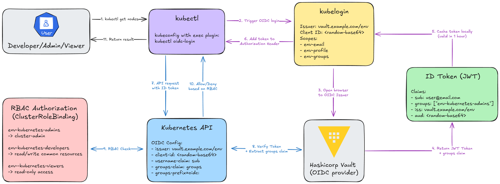

# Cluster Access with OIDC Authentication

This guide covers accessing your RKE2 cluster using OIDC authentication via HashiCorp Vault.

**Blog post:** <https://phuchoang.sbs/posts/gitops-kubernetes-oidc-vault>



## Prerequisites

- Cluster successfully deployed
- [int128/kubelogin](https://github.com/int128/kubelogin) installed
- HashiCorp Vault configured with OIDC provider
- User credentials in Vault

## Step 1: Install kubelogin

Follow the installation instructions at [int128/kubelogin](https://github.com/int128/kubelogin).

## Step 2: Create Kubeconfig File

Create a kubeconfig file (e.g., `~/.kube/dev-config.yml`):

```yaml
apiVersion: v1
kind: Config
clusters:
  - cluster:
      server: https://10.69.1.110:6443 # Replace with your VIP
      insecure-skip-tls-verify: true # Only if using self-signed certs
    name: dev-rke2
contexts:
  - context:
      cluster: dev-rke2
      user: vault-oidc
    name: dev-rke2
current-context: dev-rke2
users:
  - name: vault-oidc
    user:
      exec:
        apiVersion: client.authentication.k8s.io/v1beta1
        command: kubectl
        args:
          - oidc-login
          - get-token
          - --oidc-issuer-url=https://vault.example.com/v1/identity/oidc/provider/dev
          - --oidc-client-id=<fetch-from-Vault>
          - --oidc-extra-scope=dev-email
          - --oidc-extra-scope=dev-profile
          - --oidc-extra-scope=dev-groups
```

### Replace Placeholders

- `10.69.1.110`: Your cluster VIP (dev: `10.69.1.110`, prod: `10.69.1.10`)
- `vault.example.com`: Your Vault instance URL
- `oidc-client-id`: Fetch the OIDC client ID from Vault (created dynamically using terraform-admin)
- Replace environment name (`dev` or `prod`) in OIDC scope names (all scopes are prefixed with environment)

## Step 3: Authenticate and Access

```bash
export KUBECONFIG=~/.kube/dev-config.yml

# Clear any cached tokens
rm -rf ~/.kube/cache/oidc-login/

# This will prompt for Vault userpass credentials
kubectl get nodes

# Verify your identity
kubectl auth whoami

# Check permissions
kubectl auth can-i create pods
```

## First-Time Login Flow

1. Browser opens to Vault login page
2. Select "Username & Password" (userpass)
3. Enter your Vault username and password
4. kubectl will cache the OIDC token

## User Permissions

Users are automatically granted permissions based on their Vault group membership:

- **{env}-kubernetes-admins**: Full cluster admin access (cluster-admin)
- **{env}-kubernetes-developers**: Read/write access to application resources
- **{env}-kubernetes-viewers**: Read-only access to all namespaces

## Modifying User Access

To modify user access, update the `terraform.tfvars` file in `terraform-admin/` and run `terraform apply`. See [Vault Setup](./vault-setup.md) for details.

## Troubleshooting

### Token Expired

If you get authentication errors, clear the token cache:

```bash
rm -rf ~/.kube/cache/oidc-login/
```

### Browser Not Opening

If the browser doesn't open automatically, copy the URL from the terminal and open it manually.

### Permission Denied

Verify your user's group membership in Vault and ensure the groups are correctly mapped to Kubernetes RBAC roles.
