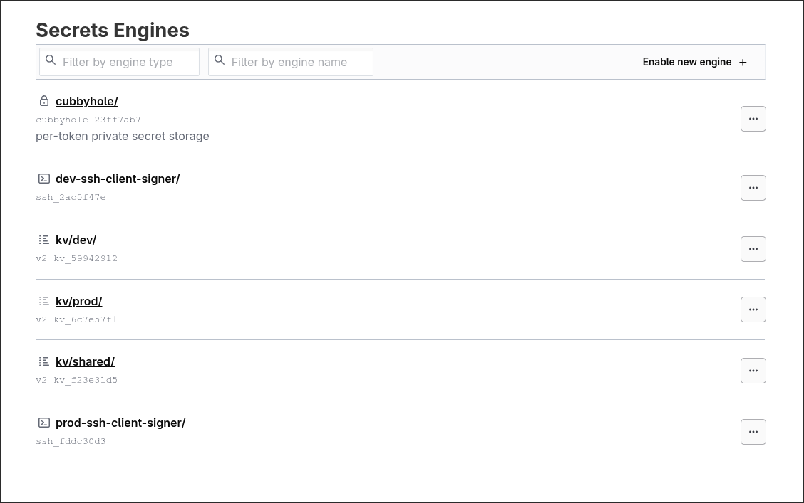

# HashiCorp Vault Setup

This guide covers the complete setup of HashiCorp Vault for managing secrets and OIDC authentication.

**Blog post:** <https://phuchoang.sbs/posts/gitops-kubernetes-oidc-vault>



## Prerequisites

- HashiCorp Vault instance (accessible via network)
- Vault CLI installed
- Appropriate Vault permissions

## Step 1: Store Secrets in Vault

You can store secrets via the Vault UI or CLI.

### Using Vault CLI

```bash
# Set Vault address and authenticate
export VAULT_ADDR="https://your-vault-address"
export VAULT_TOKEN="your-vault-token"

# Shared secrets (used by both dev and prod)
vault kv put kv/shared/minio access_key="..." secret_key="..."
vault kv put kv/shared/proxmox endpoint="..." username="..." password="..."
vault kv put kv/shared/cloudflare api_token="..." domain="..." email="..."

# Dev environment secrets
vault kv put kv/dev/ip vip="10.69.0.10" cidr="24" lb_range="10.69.0.50-10.69.0.100" ingress="10.69.0.50"
vault kv put kv/dev/rke2 token="your-rke2-token"

# Prod environment secrets
vault kv put kv/prod/ip vip="10.69.1.10" cidr="24" lb_range="10.69.1.50-10.69.1.100" ingress="10.69.1.50"
vault kv put kv/prod/rke2 token="your-rke2-token"
```

## Step 2: Configure Vault Users

Create a `terraform.tfvars` file in the `terraform-admin/` directory to define your users:

```bash
cd terraform-admin
cp terraform.tfvars.example terraform.tfvars
```

Edit `terraform.tfvars` and customize with your users:

```hcl
vault_addr = "https://vault.example.com"

users = {
  # Admin user with full access to both dev and prod
  "admin-user" = {
    email    = "admin@example.com"
    password = "CHANGE-ME-SECURE-PASSWORD"
    groups = {
      dev_role  = "admins"
      prod_role = "admins"
    }
  }

  # Developer with dev access only
  "developer" = {
    email    = "developer@example.com"
    password = "CHANGE-ME-SECURE-PASSWORD"
    groups = {
      dev_role  = "developers"
      prod_role = null # No prod access
    }
  }

  # Viewer with read-only access to both environments
  "viewer" = {
    email    = "viewer@example.com"
    password = "CHANGE-ME-SECURE-PASSWORD"
    groups = {
      dev_role  = "viewers"
      prod_role = "viewers"
    }
  }
}
```

### Available Roles

- `"admins"` - Full cluster admin access (cluster-admin)
- `"developers"` - Read/write access to application resources
- `"viewers"` - Read-only access to all namespaces
- `null` - No access to that environment

## Step 3: Deploy Vault Admin Resources

```bash
cd terraform-admin

# Set the same address as a Terraform variable (used for OIDC issuer URL)
export TF_VAR_vault_addr="$VAULT_ADDR"

# Set your S3 backend credentials
export AWS_ACCESS_KEY_ID=$(vault kv get -field=access_key kv/shared/minio)
export AWS_SECRET_ACCESS_KEY=$(vault kv get -field=secret_key kv/shared/minio)

terraform init
terraform apply
```

This creates in a single apply:

- JWT authentication backend for GitHub Actions
- Environment-specific policies for dev and prod
- SSH Certificate Authority for both environments
- Vault roles for push and PR workflows
- OIDC provider configuration for Kubernetes authentication
- Vault groups for Kubernetes RBAC (admins, developers, viewers)
- OIDC scopes with groups claim support
- Vault users with group memberships (from terraform.tfvars)

### Kubernetes RBAC Roles Created

- `{env}-kubernetes-admins`: Full cluster admin
- `{env}-kubernetes-developers`: Application developer access
- `{env}-kubernetes-viewers`: Read-only access

## Modifying User Access

To modify user access, update the `terraform.tfvars` file in `terraform-admin/` and run `terraform apply` again.
